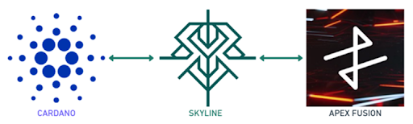

# Introduction

As blockchain technology rapidly matures, the vision of an interconnected decentralized economy has emerged as one of its most ambitious and promising frontiers. Blockchain ecosystems have quickly realized that in isolation, their growth and innovation potential is severely limited. Today, interoperability—the ability to seamlessly transfer assets and data between distinct blockchain networks—stands as one of the paramount challenges of the decentralized world, essential to unlocking the full promise of blockchain technology.&#x20;

The Skyline bridge (Figure 1) emerges precisely to address this critical challenge of blockchain interoperability, particularly targeting the communication between two prominent Unspent Transaction Output (UTXO) based blockchain platforms: Cardano and Apex Fusion. Both Cardano and Apex Fusion represent advanced UTXO-based blockchain ecosystems, boasting strong security guarantees, advanced cryptographic protocols, and innovative smart contract platforms. Yet, despite their technological advancements they remain largely isolated from one another due to the absence of a direct interoperability solution.

<figure><figcaption>
Figure 1 - Global overview of Skyline
</figcaption></figure>

Skyline resolves this critical limitation by serving as a decentralized gateway between these two blockchains, effectively enabling the seamless exchange of native assets: ADA from Cardano and Apex from Apex Fusion. Skyline securely locks native tokens on the originating blockchain and simultaneously unlocks their wrapped equivalents (WADA and WApex) on the destination blockchain. This solution elegantly combines security, decentralization, and usability, aligning with blockchain's fundamental principles of transparency.

Skyline is designed to operate without reliance on any centralized authority, ensuring resilience and censorship resistance. Its decentralized validation system utilizes multisignature UTXOs—one of the strongest cryptographic primitives inherent to both Cardano and Apex Fusion platforms. Moreover, Skyline is designed with user convenience in mind, offering an intuitive and approachable user interface, automated refund mechanisms for possible transaction failures, and robust liquidity management—features that dramatically improve the end-user experience.

This document details the comprehensive vision, system design, and operational principles of the Skyline, including a thorough exploration of its architectural components, its underlying mechanisms for security and decentralization, and the practical implications of enabling interoperability between Cardano and Apex Fusion ecosystems.
