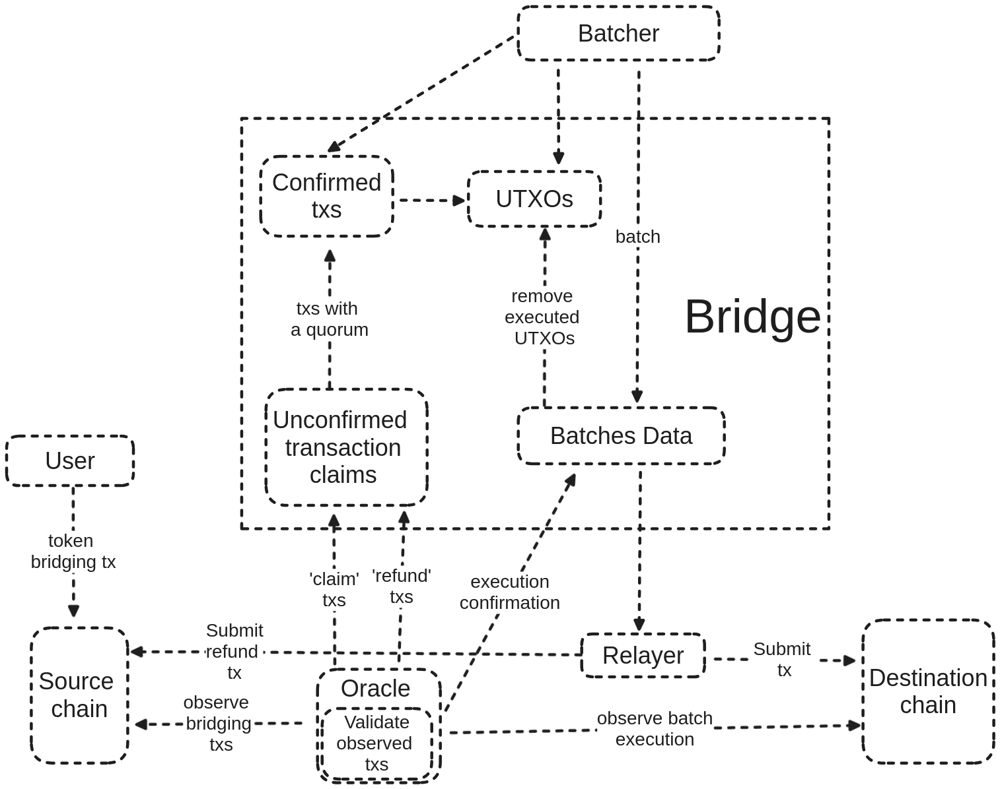

# Components

Figure 2 illustrates the primary architectural components of the Skyline system.

<figure><figcaption>
Figure 2 - Main Skyline Components
</figcaption></figure>

### Oracle

Oracle is an off-chain component operated by each validator within the Skyline’s blockchain. Its primary role is to monitor key bridge activities, including:

1. Bridging requests
2. Batch executions

Bridging requests are identified by tracking transactions that generate output UTXOs associated with the Skyline’s multisig address, which controls the bridging funds. Once such a transaction is detected, it undergoes validation. If deemed valid, its data is incorporated into a new ‘claim’ transaction and submitted to the Skyline’s blockchain.

Similar claim transactions, containing relevant details, are also submitted for Batch executions and refunds. The metadata stored in executed transactions helps classify the type of bridge-related activity (e.g., bridging request, Batch execution, refund processing, etc.). In the case of Batch executions, the Oracle verifies not only the metadata but also whether the observed transaction is signed by the multisig address to ensure security.

Only Oracles operated directly by Skyline’s validator nodes are authorized to submit claim transactions, positioning them as integral and highly trusted entities within the Skyline ecosystem. For instance, when a bridging request occurs, Oracles independently submit claim votes to the Skyline blockchain, each attesting to the validity and confirmation of the transaction on the source blockchain. Once the Skyline blockchain accumulates a sufficient number of these independent validator-submitted claim votes—achieving decentralized consensus—the bridging request is officially recognized as valid and securely advances to the subsequent batching phase.

### Batcher

Each bridge validator operates a trusted off-chain component known as the Batcher, responsible for monitoring the Skyline’s blockchain and determining the appropriate time to initiate a Batch creation. The Batcher generates a Batch instance representing the transaction that will be executed on the destination blockchain.

In addition to creating the Batch, each Batcher must submit two signatures to the bridge blockchain. One signature is produced by the key associated with the multisig address that controls fund unlocking, while the other is generated by the key linked to the multisig address responsible for covering network fees on the destination chain.


Once a Batch is created and submitted to the Skyline blockchain, it requires a quorum of validator approvals to proceed. Validators independently submit their votes, confirming the Batch’s validity and correctness. When the necessary consensus threshold is met—meaning a sufficient number of validator approvals have been collected—the Batch achieves finalization. At this point, it is securely and automatically prepared for execution on the destination blockchain.

### Relayer

After a Batch is confirmed, it must be submitted to the destination blockchain. To handle this process, a dedicated trustless component is required, operating as a single standalone instance. This component, called Relayer, can be run by any participant in the system, as only one instance is needed.

The Relayer's primary role is to retrieve Batches from the Skyline’s blockchain and submit the corresponding transactions to the destination chain. Before doing so, it must aggregate individual validator signatures from the Batch to generate the necessary multisignature, which authorizes the spending of input UTXOs specified in the Batch.


Notably, the Relayer does not cover the network fee for the transaction. Instead, the fee is paid by the multisig address that signed the Batch, using a UTXO included in the transaction input.
