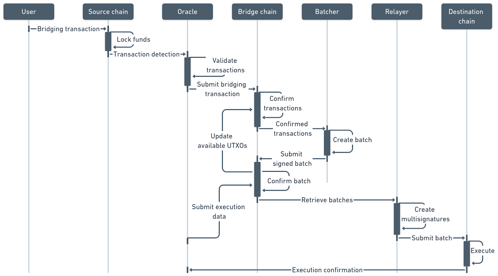

# Dataflow between System Components

Deposit and withdrawal dataflows operate similarly, so “source” and “destination” are used as terms to describe Apex Fusion and Cardano sides:

1.  **Bridging initiation**

    The sender initiates bridging by creating a transaction on the source chain. The input will be UTXO which belongs to the sender address. This UTXO is used to cover the fees and the funds to be bridged. The funds that will be bridged will be locked at the multisig address owned by the bridge. Transaction metadata will contain information required to complete the bridging (e.g., destination address, chain id, amount, etc.)
2.  **Bridging transactions detection**

    Each validator runs an off-chain component (Oracle) responsible for monitoring bridging requests. This will be done by observing transactions on the source chain that are producing output UTXO related to the bridge multisig address.
3.  **Bridging transactions witnessing**

    Each Oracle submits the transaction (a “claim”) to the Skyline’s blockchain to confirm that it has observed the bridging request.
4.  **Bridging transactions confirmation**

    When the quorum of the validator Oracle votes is gathered to confirm that a bridging request has occurred, the bridging request is considered to be valid and ready to enter the Batch.
5.  **Transactions batching**

    Confirmed bridging requests remain stored on the Skyline’s blockchain until it's time to create a new Batch. In this workflow, a Batch is a UTXO transaction that will be executed on the destination blockchain. The Batch can be created when a sufficient number of bridging requests have been confirmed, or when the maximum time limit between two Batches has been reached.
6.  **Batch confirmation**

    In order to submit the Batch to the destination blockchain, the Batch must be confirmed by the quorum of Skyline validators. Validators confirm the Batch by signing it with their private keys which control the multisig address on the destination blockchain.
7.  **Batch submission**

    The Batch transaction gets submitted to the destination blockchain by a Relayer. The bridging funds are unlocked from the bridge-controlled multisig address on the destination chain and transferred to the destination addresses.

Figure 3 provides a visual representation of the data flow described in the preceding text.

<figure><figcaption>
Figure 3 - System Components Dataflow
</figcaption></figure>
